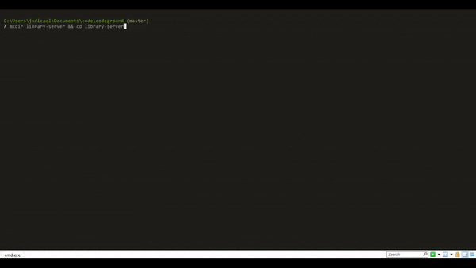

## CLI tool to bootstrap new rest api app



use this command to start
```
npx create-rest-api
```

### we have 2 options to start a fresh new rest api project
choose what language do you want to use

- javascript
- typescript

Wait until the installation is DONE and you're ready to go
